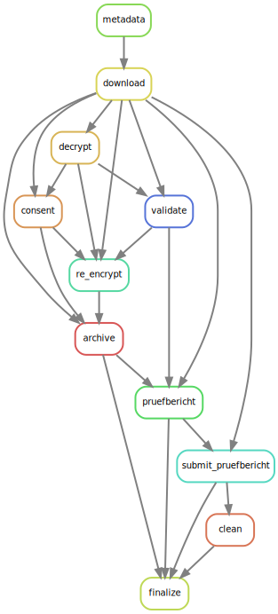

# grz-watchdog
A prototype of a snakemake workflow for the grz-ingest process.
Can either be run in monitor/daemon mode or batch mode.

## Setup


``` bash
pixi shell
```

## Examples

### Processing a specific submission ID
Process a specific submission by supplying the submitter ID, inbox name and whether or not to perform deep qc:
```sh
SUBMITTER_ID="123456789"
INBOX="test1"  # with corresponding inbox config path defined in config/config.yaml
SUBMISSION_ID="123456789_2025-09-22_aabbccdd"
QC="with_qc"   # or "without_qc"
snakemake results/${SUBMITTER_ID}/${INBOX}/${SUBMISSION_ID}/target/${QC}
```





### Batch Processing
Depending on the `batch: limit` in `config/config.yaml`, determine and take up to `limit` submissions ready for processing (by means of an automatic inbox scan) and submit these:
```sh
snakemake  # default target rule is `pending`
```


## Testing setup
1. Download [WES_tumor+germline](https://www.cmm.in.tum.de/public/grz-example-submissions/WES_tumor+germline) example submission:
    ```sh
    mkdir -p data
    wget -r -np -nH --include-directories 'public/grz-example-submissions/WES_tumor+germline' -R "index.html*" --cut-dirs=2 https://www.cmm.in.tum.de/public/grz-example-submissions/WES_tumor+germline
    mv WES_tumor+germline data/123456789_1970-01-01_a0b1c2d3
    ```
2. Encrypt data with testing key-pair (`config/configs/keys/watchdog-test.{pub,sec}`)
    ```sh
    grzctl encrypt --config-file config/configs/inbox.test1.yaml --submission-dir data/WES_tumor+germline
    ```
3. Move/rename `encrypted_files` to `files`
    ```sh
    mv data/123456789_1970-01-01_a0b1c2d3/encrypted_files data/123456789_1970-01-01_a0b1c2d3/files
    ```
4. Run docker compose (automatically triggers workflow)
    ```sh
    docker compose up --build
    ```

### Docker compose
Comes with minio and minio-client (mc), sets up testing S3 storage, see `docker-compose.yaml` for more info.
Test config is in `tests/config`. Working directory is in `tests/workflow-workdir`.
```sh
docker compose up --build
```
